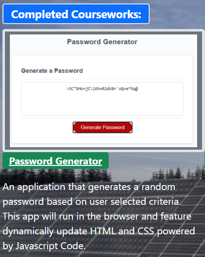
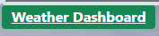
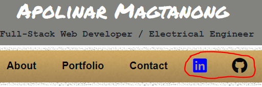

# Update Portfolio

This project is an update version of the 'Responsive Portfolio using Bootstrap' project.

## Project Notes

Some enhancement were done in this project particularly the use of Bootstrap 5 to re-design the pages.

Background image and google fonts were also added to improve the typography of the pages.

In the Portfolio page, two of the homework assignments and project 1 were highlighted. 

If you hover to the image corresponding to the homework or project, a description text will be displayed as shown below:

To open the URL for each project, click the following icon:

In addition, I have also added link to linkedIn and Github pages in the About Me Page as shown below:

Furthermore, in my Github page, I have update my Github profile with pinned repositories featuring project 1 and two exemplary assignments.

## The application could be accessed using the following link:
https://apolinar291076.github.io/Weather-Dashboard/

## The repo for the application could be accessed using the following link:
https://github.com/Apolinar291076/Weather-Dashboard.git

